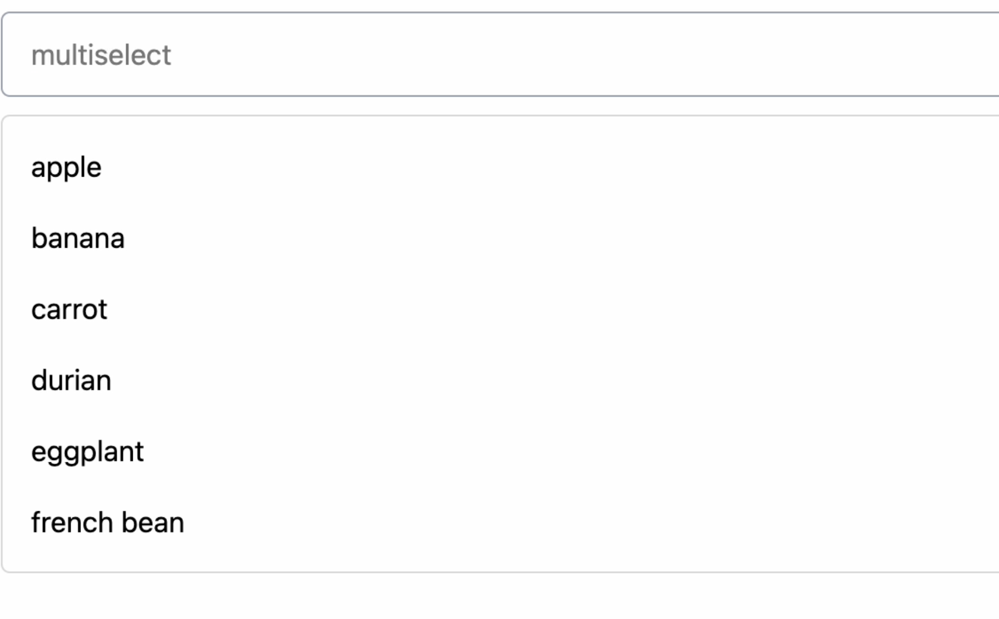
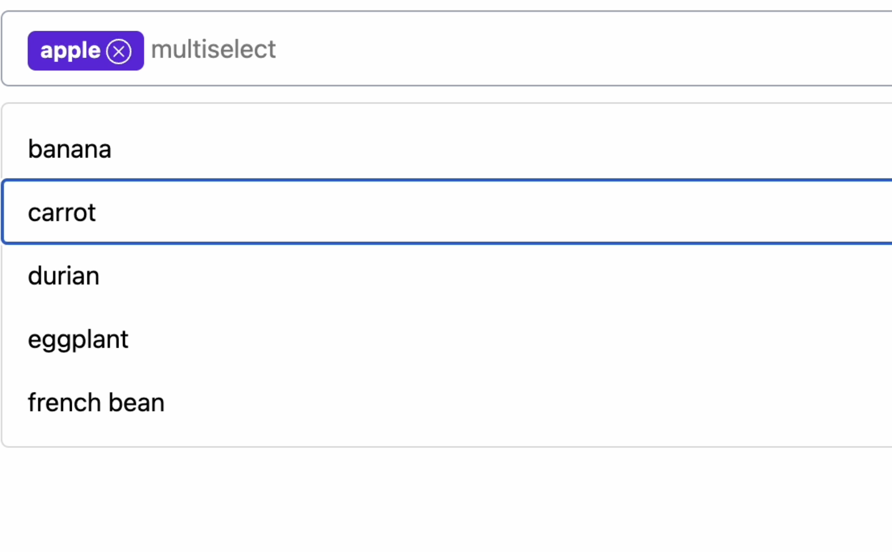
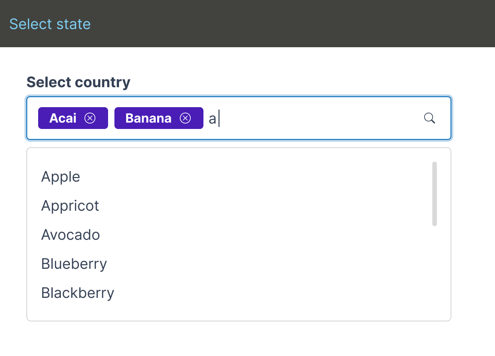
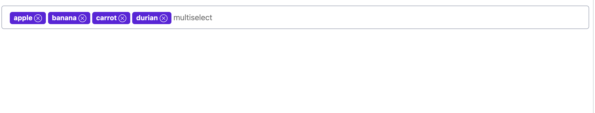

# Singapore Government Design System Frontend Challenge

We thank you for taking the time to do this coding challenge. Please read the guidelines before getting started.

## Assessment Guidelines:

- The purpose of this assessment is to help us evaluate your coding skills and learning capability.
- This assessment uses [Lit](https://lit.dev/) framework to build web component
- You are allowed to use any resource on the internet but the code should be entirely written by you. 
- You must use the skeleton project as the starting point 
- You are allowed to refactor and make modifications to any of the existing code. 
- Clone the repository and upload to your github profile
- Please try to commit often and add messages to your commits so we can more easily review your work.
- You are also expected to write clean code.
- Submit the github repository link to us


## Problem Statement 

You are provided with a single select combo box that has already been implemented. Your task is to change the combobox to allow multiple selected values.
When values are selected, it is reflected as a badge within the combobox's input

## Requirements 

### Adding the badge 
1. When values in the menu are selected, it is reflected as a badge within the combobox's input 
2. User can select the menu items by three ways: keyboard, mouse and typing in the input. 
  - Keyboard interaction: User navigates to the menu item with arrow keys --> selects it with "Enter" --> badge reflected on combobox 
  - Mouse interaction: User clicks on the menu item --> badge reflected on combobox  
  - Typing in the input interaction: User types on the combobox's input --> there is a match with menu item --> badge reflected on combobox  
3. Whenever a menu item is selected and has its badge reflected on the combobox, the menu item is also removed temporarily from the dropdown menu. 

### Removing the badge 
4. User can remove badge on combobox via two ways 
  - Keyboard: User press backspace right before the badge --> badge is removed
  - Mouse: User clicks on the badge --> badge is removed. 
5. Whenever a badge is removed on the combobox, its value should be restored in the dropdown menu. 

### Menu behaviour 
6. When a badge is added, the dropdown menu should close 
7. The dropdown menu should remain open when user is typing until there is a match and a badge is added
8. When deleting badges, the dropdown menu remains close 

### Image examples





## Additional info
1. This skeleton project uses Lit, Typescript, SASS. 
2. We have provided you with the `my-badge` component to implement the multi selected combobox
3. You should focus on `src/my-combo-box.ts` component but you are free to make changes in other components when you require.
4. You can use third-party library like lodash if you require, but not component libraries. i.e. you should not be using another library's combo box for this assignment.

## Get Started

Clone the repo. Then install.

```bash
npm install
```

Then start the dev server and rollup watchers

```bash
npm run dev
```

A browser window should open and rollup will watch your files for changes.